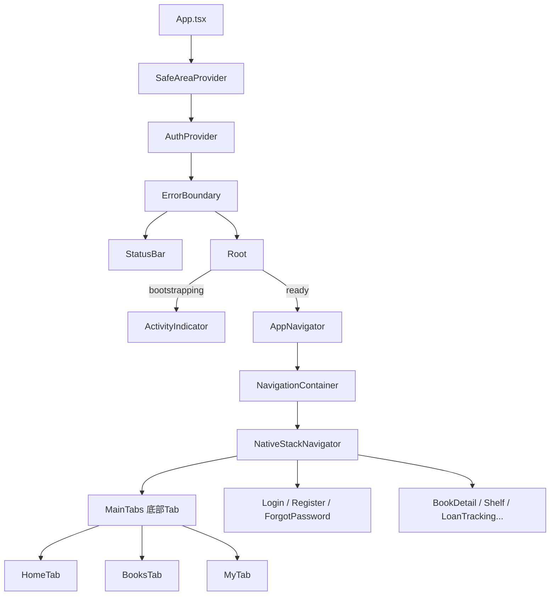

# front-android 项目分析报告

## 项目概述

**智慧图书馆 Android 读者端**，基于 **Expo SDK 53 + React Native 0.79 + React 19 + TypeScript** 构建，面向移动端读者提供图书馆核心业务功能。项目不包含后台管理能力，所有接口与 Web 端、小程序端共享同一套后端 API。

---

## 技术栈

| 层级 | 技术选型 | 版本 |
|------|---------|------|
| 框架 | Expo (Managed + Custom Dev Client) | SDK 53 |
| UI 引擎 | React Native | 0.79.6 |
| 核心库 | React | 19.0.0 |
| 语言 | TypeScript (strict mode) | 5.8.3 |
| 导航 | React Navigation (Native Stack + Bottom Tabs) | v7 |
| 本地存储 | AsyncStorage | 2.1.2 |
| 图标库 | @expo/vector-icons (MaterialCommunityIcons) | 14.1.0 |
| 网络层 | 原生 fetch（自封装 `http.ts`，无 Axios） | — |
| 构建 | Babel (babel-preset-expo 13) | — |

---

## 目录结构

```
front-android/
├── App.tsx                    # 根组件（SafeArea → Auth → ErrorBoundary → Navigator）
├── app.json                   # Expo 配置（仅 android 平台）
├── package.json               # 依赖管理
├── tsconfig.json              # TypeScript 配置（extends expo/tsconfig.base, strict）
├── .env                       # 环境变量（API_BASE_URL）
├── android/                   # 原生 Android 工程（非 Prebuild 驱动）
└── src/
    ├── config/env.ts           # API 基础 URL 配置
    ├── theme.ts                # 设计令牌（颜色/间距/圆角/阴影）
    ├── navigation/             # 导航层
    │   ├── AppNavigator.tsx    # 根栈导航器（17 个路由）
    │   ├── MainTabs.tsx        # 底部 Tab（首页/图书/我的）
    │   └── types.ts            # 路由参数类型
    ├── screens/                # 19 个业务页面
    ├── services/               # 17 个 API 服务模块
    │   └── http.ts             # HTTP 基础设施（鉴权/超时/刷新/错误）
    ├── store/auth.tsx          # 认证 Context（登录/登出/令牌刷新）
    ├── components/             # 通用 UI 组件
    │   ├── Ui.tsx              # 按钮/标签/卡片/封面/输入框
    │   ├── Screen.tsx          # 页面布局（Hero 头部/卡片/章节标题）
    │   └── ErrorBoundary.tsx   # 全局错误边界
    ├── features/               # 领域特性模块
    │   ├── home/               # 首页（快捷入口 + 数据 Hook）
    │   ├── books/              # 图书目录（筛选/分类/目录卡片/Hook）
    │   └── my/                 # 我的（快捷入口 + 仪表盘 Hook）
    ├── types/                  # 类型定义
    │   ├── api.ts              # 后端 DTO（554 行，15 个业务域）
    │   ├── auth.ts / book.ts / user.ts
    │   └── global.d.ts         # 全局类型声明
    ├── hooks/                  # 自定义 Hook（useDebouncedValue）
    ├── utils/                  # 工具函数
    │   ├── storage.ts          # AsyncStorage 封装（token/user 持久化）
    │   ├── events.ts           # 发布-订阅事件总线（14 种事件）
    │   └── format.ts           # 格式化工具（日期/货币/数值）
    └── demo/catalog.ts         # 内置演示数据（离线降级）
```

---

## 核心架构分析

### 1. 组件层级



### 2. 网络请求架构

[http.ts](file:///e:/001-a-kese/1/front-android/src/services/http.ts) 实现了完整的 HTTP 基础设施：

- **统一入口**：`request<TResponse>()` 封装 fetch，自动拼接 `API_BASE_URL`
- **鉴权机制**：`auth: true` 时自动从 AsyncStorage 读取 Bearer Token
- **超时控制**：默认 10s，通过 AbortController 实现
- **401 自动刷新**：遇到 401 时调用 `tokenRefreshHandler` 获取新 token 并重试，去重机制防止并发刷新
- **全局登出**：刷新失败后调用 `unauthorizedHandler` 静默登出
- **错误处理**：统一的 `HttpError` 类，附带状态码和业务错误信息

### 3. 认证状态管理

[auth.tsx](file:///e:/001-a-kese/1/front-android/src/store/auth.tsx) 基于 React Context 实现：

- **启动引导**：从 AsyncStorage 恢复 token → 后端验证 → 离线降级到缓存用户
- **双令牌**：access token + refresh token，支持自动续期
- **去重刷新**：`useRef` 保证并发 401 只触发一次刷新请求
- **事件广播**：登录/登出/刷新后通过事件总线通知各模块

### 4. 设计系统

[theme.ts](file:///e:/001-a-kese/1/front-android/src/theme.ts) 定义了完整的设计令牌体系：

- **色彩**：暖色调米黄系底色 + 墨绿主色调 + 暖橙强调色，共 16 个语义化色值
- **间距**：6 级递增（8px → 36px）
- **圆角**：4 级（12px → 36px）
- **阴影**：3 级预设（soft / card / floating）

---

## 业务功能覆盖

### 页面清单（19 个 Screen）

| 页面 | 文件 | 功能描述 |
|------|------|---------|
| 首页 | `HomeScreen.tsx` | 统计数据 + 精选推荐 + 新上架 + 分类概览 + 快捷入口 |
| 图书目录 | `BooksScreen.tsx` | 搜索 + 筛选 + 分类浏览 |
| 图书详情 | `BookDetailScreen.tsx` | 书籍信息 + 副本状态 + 预约/收藏/评论 |
| 我的 | `MyScreen.tsx` | 用户概览仪表盘 + 快捷入口矩阵 |
| 登录/注册/找回密码 | `Login/Register/ForgotPassword` | 完整认证流程 |
| 我的书架 | `ShelfScreen.tsx` | 收藏图书管理 |
| 借阅追踪 | `LoanTrackingScreen.tsx` | 当前借阅 + 历史记录 |
| 图书预约 | `ReservationsScreen.tsx` | 预约管理 + 取消 |
| 罚款管理 | `FinesScreen.tsx` | 罚款列表 + 状态查看 |
| 通知中心 | `NotificationsScreen.tsx` | 消息列表 + 已读管理 + 路由跳转 |
| 帮助与反馈 | `HelpFeedbackScreen.tsx` | 反馈提交 + 历史查看 |
| 个人资料 | `ProfileScreen.tsx` | 用户信息编辑 |
| 服务预约 | `AppointmentsScreen.tsx` | 还书/取书/咨询预约 |
| 座位预约 | `SeatReservationsScreen.tsx` | 座位选择 + 预约管理 |
| 推荐动态 | `RecommendationsScreen.tsx` | 推荐帖发布 + 点赞 + 关注 |
| 我的评论 | `ReviewsScreen.tsx` | 评论管理 |
| 搜索历史 | `SearchHistoryScreen.tsx` | 搜索记录 + 快速重搜 |

### API 服务模块（17 个 Service）

覆盖：认证、图书、副本、收藏、反馈、罚款、借阅、通知、公共接口、推荐、预约、评论、搜索、座位预约、服务预约、用户管理、HTTP 基础设施。

---

## 项目统计

| 指标 | 数值 |
|------|------|
| 源代码文件 | **55 个** (.ts/.tsx) |
| 业务页面 | **19 个** Screen |
| API 服务 | **17 个** Service |
| 通用组件 | **3 个** (Ui/Screen/ErrorBoundary) |
| DTO 类型定义 | **554 行** (15 个业务域) |
| 事件类型 | **14 种** AppEvent |
| 导航路由 | **17 个** (3 Tab + 14 Stack) |
| 运行时依赖 | **9 个** |
| 开发依赖 | **5 个** |
| 总代码量 | 约 **310KB** 源码 |

---

## 架构特点

1. **轻量依赖**：仅 9 个运行时依赖，无 Axios/Redux/MobX，HTTP 和状态管理均为自研封装
2. **类型安全**：TypeScript strict 模式，554 行 DTO 定义确保前后端契约严格对齐
3. **离线容错**：启动引导时后端不可达可回退到本地缓存用户；首页/图书页有内置演示数据降级
4. **事件驱动**：轻量发布-订阅总线替代全局状态管理库，14 种事件覆盖所有写操作后的数据刷新
5. **设计一致性**：统一设计令牌体系，所有页面共享相同的色彩/间距/阴影/圆角配置
6. **原生工程独立维护**：`android/` 目录直接管理包名、签名、新架构开关等原生配置，不依赖 Expo Prebuild

---

## 当前边界与限制

- 只覆盖**读者侧**功能，不含管理后台
- 找回密码依赖后端 Email 服务联调
- 真机调试需手动切换 `.env` 中的 API 地址
- 无单元测试/E2E 测试配置
- 无国际化（i18n）支持，界面语言固定为中文
