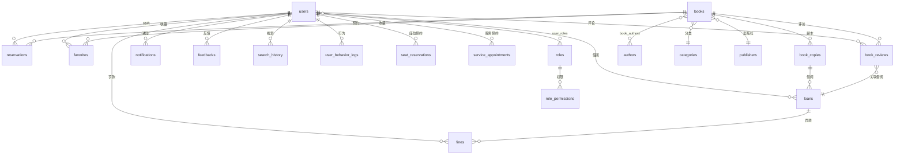

# 数据库设计

## 1. E-R 关系图

## 2. 核心表结构一览

### 2.1 用户与权限

| 表名 | 说明 | 核心字段 |
|---|---|---|
| `users` | 用户（读者+管理员） | user_id, username, email, full_name, role, status, department, major, interest_tags |
| `roles` | 角色定义 | role_id, name, description |
| `user_roles` | 用户-角色多对多 | user_id, role_id |
| `role_permissions` | 角色-权限映射 | role_id, permission |

### 2.2 图书编目

| 表名 | 说明 | 核心字段 |
|---|---|---|
| `books` | 图书元数据（SPU） | book_id, isbn, title, cover_url, description, published_year, publisher_id, category_id |
| `book_copies` | 馆藏副本（SKU） | copy_id, book_id, status, location_code, rfid_tag, price |
| `categories` | 分类（支持层级） | category_id, name, parent_id |
| `authors` | 作者 | author_id, name, biography |
| `book_authors` | 图书-作者多对多 | book_id, author_id, author_order |
| `publishers` | 出版社 | publisher_id, name, address |

### 2.3 核心业务

| 表名 | 说明 | 核心字段 |
|---|---|---|
| `loans` | 借阅记录 | loan_id, copy_id, user_id, borrow_date, due_date, return_date, status, renewal_count |
| `reservations` | 预约记录 | reservation_id, book_id, user_id, status, expiry_date, allocated_copy_id, pickup_deadline |
| `fines` | 罚款记录 | fine_id, loan_id, user_id, amount, reason, status, date_issued, date_paid |
| `favorites` | 收藏 | user_id, book_id |
| `book_reviews` | 评论评分 | review_id, book_id, user_id, loan_id, rating, comment_text, status |

### 2.4 通知与交互

| 表名 | 说明 | 核心字段 |
|---|---|---|
| `notifications` | 系统通知 | notification_id, user_id, type, title, content, is_read, target_type, route_hint |
| `feedbacks` | 用户反馈 | feedback_id, user_id, subject, content, status, admin_reply |
| `search_history` | 搜索历史 | search_id, user_id, keyword, result_count |
| `user_behavior_logs` | 行为日志 | log_id, user_id, book_id, action_type, duration_seconds |

### 2.5 增值服务

| 表名 | 说明 | 核心字段 |
|---|---|---|
| `seats` | 座位信息 | seat_id, seat_code, floor_name, zone_name, seat_type, has_power, near_window, status |
| `seat_reservations` | 座位预约 | id, user_id, seat_id, start_time, end_time, status, notes |
| `service_appointments` | 服务预约 | id, user_id, service_type, method, status, loan_id, return_location, scheduled_time |

### 2.6 社交推荐

| 表名 | 说明 | 核心字段 |
|---|---|---|
| `recommendation_posts` | 推荐动态 | post_id, user_id, book_id, content, scope, like_count |
| `recommendation_likes` | 推荐点赞 | id, post_id, user_id |
| `recommendation_follows` | 推荐关注 | id, follower_id, following_id |

### 2.7 系统与安全

| 表名 | 说明 | 核心字段 |
|---|---|---|
| `refresh_tokens` | 刷新令牌 | id, user_id, token, expiry_date |
| `rbac_audit_logs` | RBAC 审计日志 | id, admin_user_id, action, target_role, timestamp |
| `ai_gateway_settings` | AI 配置 | id, provider, model, enabled |
| `user_feedback_messages` | 反馈跟进消息 | id, feedback_id, sender_role, content, create_time |

## 3. 关键设计说明

### 3.1 SPU-SKU 模型
- `books` 是图书元数据（SPU），一本ISBN只有一条记录
- `book_copies` 是物理副本（SKU），一本书可有多个副本
- 借阅绑定的是副本（copy_id），预约绑定的是图书（book_id）

### 3.2 状态枚举设计
- 副本状态：`AVAILABLE → BORROWED → AVAILABLE`（正常借还循环）
- 借阅状态：`ACTIVE → RETURNED`（正常），`ACTIVE → OVERDUE → RETURNED`（逾期），`ACTIVE → LOST`（遗失）
- 预约状态：`PENDING → AWAITING_PICKUP → FULFILLED`（正常），可 `CANCELLED` 或 `EXPIRED`
- 罚款状态：`PENDING → PAID`（缴纳），`PENDING → WAIVED`（豁免）

### 3.3 级联触发规则
- 逾期归还 → 自动生成罚款记录 + 通知
- 图书遗失 → 自动生成赔偿罚款 + 通知
- 预约到书 → 更新预约状态 + 发送到馆通知
- 罚款缴纳/豁免 → 更新罚款状态 + 发送通知
