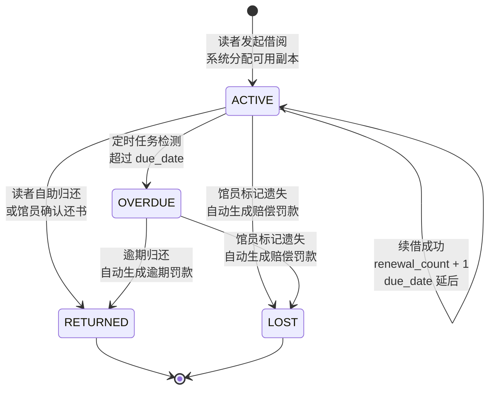
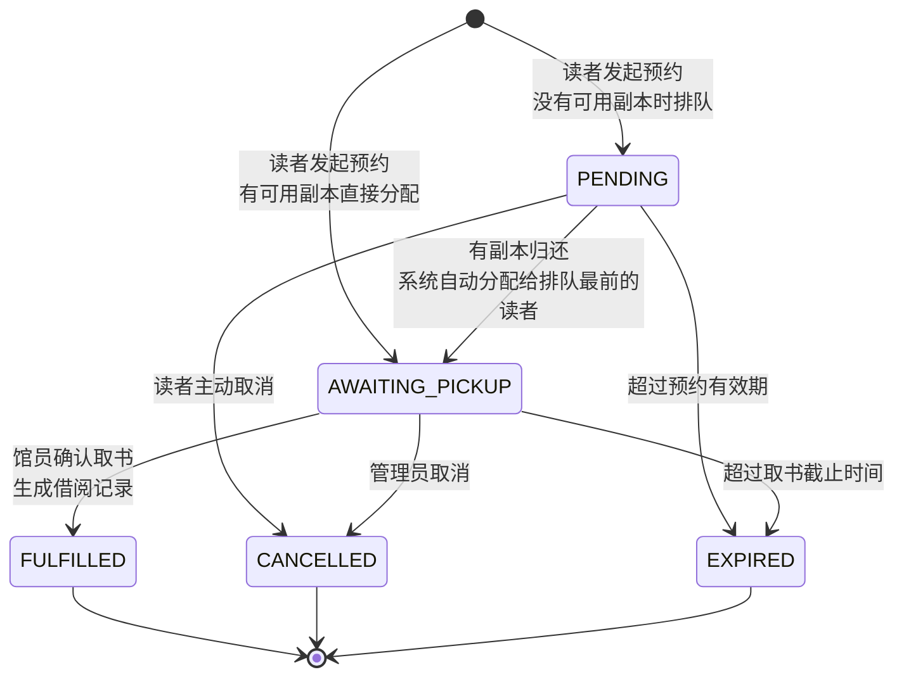
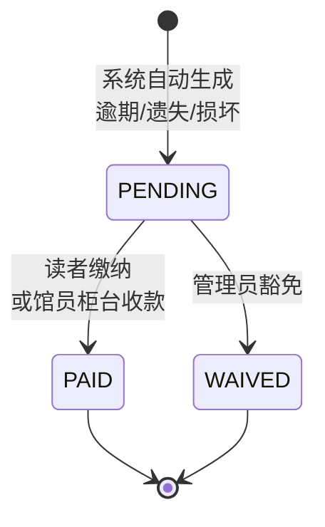
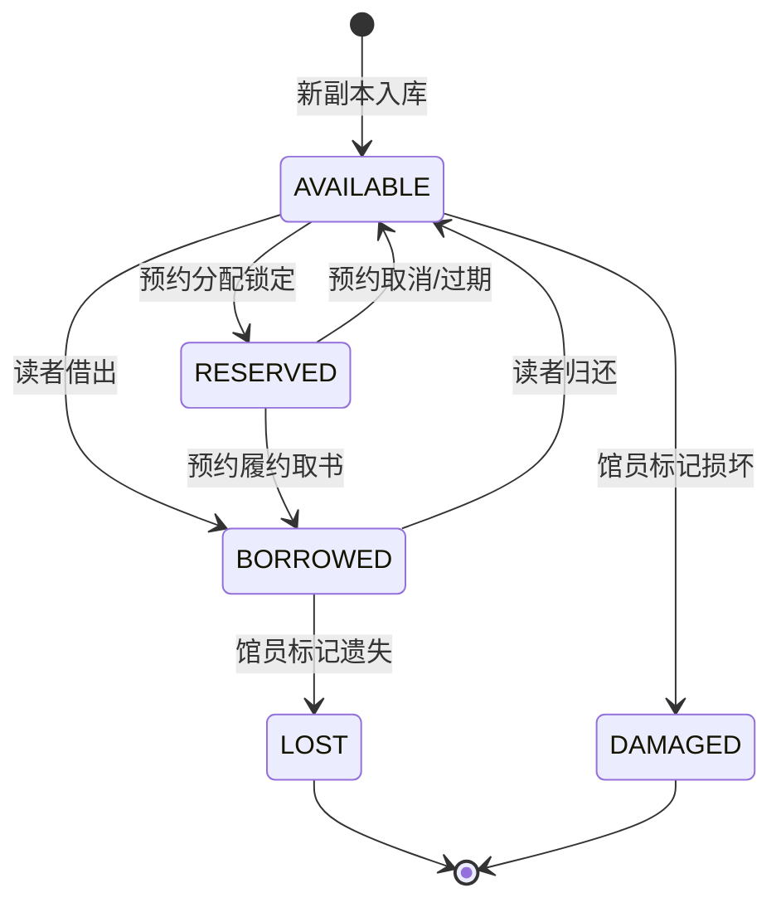
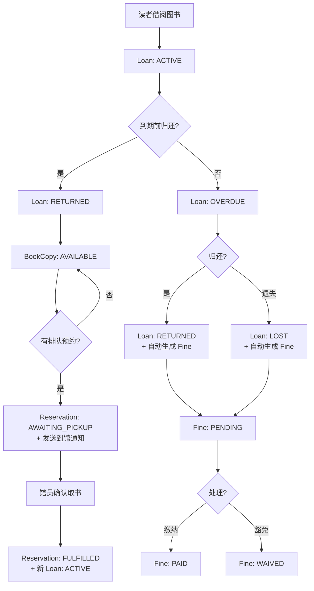

# 核心业务状态机

## 1. 借阅生命周期

### 借阅业务规则
| 规则 | 说明 |
|---|---|
| 借阅上限 | 系统校验当前借阅数量 |
| 续借限制 | 最多续借 N 次，且该书无人预约排队时才可续借 |
| 逾期检测 | 定时任务每日检查，将超期的 ACTIVE 标记为 OVERDUE |
| 逾期罚款 | 逾期归还时自动计算罚款金额并生成 Fine 记录 |
| 遗失赔偿 | 标记遗失时按副本价格生成赔偿罚款 |
| 未缴罚款 | 有未缴罚款的读者不能借新书 |

---

## 2. 预约生命周期

### 预约业务规则
| 规则 | 说明 |
|---|---|
| 副本分配 | 发起预约时若有可用副本，直接分配并进入 AWAITING_PICKUP |
| 排队顺序 | 多人预约同一本书时，按预约时间先后排队 |
| 到馆通知 | 副本分配成功后系统自动发送通知 |
| 取书期限 | AWAITING_PICKUP 状态有取书截止时间（pickup_deadline） |
| 履约校验 | 履约时校验读者未缴罚款和借阅上限 |
| 自动过期 | 定时任务检查超过有效期的预约 |

---

## 3. 罚款生命周期

### 罚款触发场景
| 触发 | 类型 | 金额规则 |
|---|---|---|
| 逾期归还 | OVERDUE | 按逾期天数计算 |
| 标记遗失 | LOST | 按副本购入价格赔偿 |
| 损坏登记 | DAMAGE | 按评估金额 |

---

## 4. 馆藏副本状态

---

## 5. 业务级联关系总图

