# 需求分析（论文第 2 章素材）

## 1 系统概述

随着高校教育信息化的不断推进，图书馆作为高校核心公共服务机构，其管理效率与读者服务体验面临新的挑战。传统图书馆管理系统多为单一桌面端管理软件，存在以下问题：

1. 读者只能在馆内终端或特定网页上查询图书信息，无法随时随地完成借阅、预约等操作。
2. 管理员缺乏统一的在线管理平台，罚款生成、预约分配等业务需要人工干预。
3. 系统不支持移动端接入，无法满足当代大学生"手机优先"的使用习惯。
4. 通知与反馈机制薄弱，读者无法及时获知借阅到期、预约到馆等关键信息。

针对上述问题，本系统的开发目标是设计并实现一个基于 Spring Boot 与 Next.js 的智慧图书馆管理系统。系统以 Web 端为主交付平台，同时提供 Android 和微信小程序作为移动端读者入口，实现馆藏查询、借阅管理、预约排队、罚款处理、通知推送等核心业务的完整闭环。

## 2 用户角色定义

本系统涉及以下两类核心用户角色：

| 角色 | 定义 | 使用终端 |
|---|---|---|
| 读者（USER） | 高校师生或访客，使用系统查询图书、借阅、预约、缴纳罚款、查看通知等 | Web、Android、微信小程序 |
| 管理员（ADMIN） | 图书馆工作人员，负责图书编目、借阅管理、罚款处理、用户管理、权限配置等 | Web 管理后台 |

此外，系统支持 RBAC（基于角色的访问控制）模型，管理员角色可进一步细分权限，例如 `loan:manage`（借阅管理权限）、`fine:waive`（罚款豁免权限）等。

## 3 用例分析

### 3.1 读者用例图

```mermaid
graph TB
    Reader((读者))
    
    subgraph 认证模块
        UC01[注册账号]
        UC02[登录系统]
        UC03[找回密码]
        UC04[退出登录]
    end
    
    subgraph 馆藏检索模块
        UC05[浏览首页推荐]
        UC06[搜索图书]
        UC07[查看图书详情]
        UC08[查看馆藏位置]
        UC09[访问线上资源]
    end
    
    subgraph 借阅管理模块
        UC10[借阅图书]
        UC11[续借图书]
        UC12[归还图书]
        UC13[查看借阅记录]
    end
    
    subgraph 预约管理模块
        UC14[预约图书]
        UC15[取消预约]
        UC16[查看预约状态]
    end
    
    subgraph 个人服务模块
        UC17[收藏图书]
        UC18[提交评论]
        UC19[查看罚款]
        UC20[缴纳罚款]
        UC21[查看通知]
        UC22[提交反馈]
        UC23[管理个人资料]
    end
    
    subgraph 增值服务模块
        UC24[浏览推荐动态]
        UC25[预约座位]
        UC26[预约到馆服务]
    end
    
    Reader --> UC01 & UC02 & UC03 & UC04
    Reader --> UC05 & UC06 & UC07 & UC08 & UC09
    Reader --> UC10 & UC11 & UC12 & UC13
    Reader --> UC14 & UC15 & UC16
    Reader --> UC17 & UC18 & UC19 & UC20 & UC21 & UC22 & UC23
    Reader --> UC24 & UC25 & UC26
```

### 3.2 管理员用例图

```mermaid
graph TB
    Admin((管理员))
    
    subgraph 统计分析模块
        UA01[查看仪表盘统计]
        UA02[查看借还趋势]
        UA03[查看预约与罚款分布]
    end
    
    subgraph 图书编目管理
        UA04[新增图书]
        UA05[编辑图书信息]
        UA06[删除图书]
        UA07[管理馆藏副本]
    end
    
    subgraph 借阅与预约管理
        UA08[查看借阅列表]
        UA09[确认还书]
        UA10[标记图书遗失]
        UA11[查看预约列表]
        UA12[履约预约]
        UA13[取消预约]
    end
    
    subgraph 罚款与反馈管理
        UA14[查看罚款列表]
        UA15[柜台收款]
        UA16[豁免罚款]
        UA17[回复用户反馈]
    end
    
    subgraph 用户与权限管理
        UA18[查看用户列表]
        UA19[封禁/解封用户]
        UA20[评论审核]
        UA21[管理角色与权限]
        UA22[查看审计日志]
    end
    
    subgraph 元数据管理
        UA23[管理作者]
        UA24[管理分类]
        UA25[管理出版社]
    end
    
    Admin --> UA01 & UA02 & UA03
    Admin --> UA04 & UA05 & UA06 & UA07
    Admin --> UA08 & UA09 & UA10 & UA11 & UA12 & UA13
    Admin --> UA14 & UA15 & UA16 & UA17
    Admin --> UA18 & UA19 & UA20 & UA21 & UA22
    Admin --> UA23 & UA24 & UA25
```

## 4 功能需求

### 4.1 用户认证与鉴权模块

| 编号 | 功能名称 | 功能描述 |
|---|---|---|
| FR-AUTH-01 | 用户注册 | 读者填写用户名、邮箱、密码完成注册，系统自动分配 USER 角色 |
| FR-AUTH-02 | 用户登录 | 用户输入凭证完成认证，系统签发 JWT 访问令牌与刷新令牌 |
| FR-AUTH-03 | 退出登录 | 用户退出时令牌加入黑名单，即时失效 |
| FR-AUTH-04 | 令牌刷新 | 访问令牌过期时通过刷新令牌获取新的访问令牌 |
| FR-AUTH-05 | 找回密码 | 用户通过邮箱申请密码重置，系统生成重置链接 |
| FR-AUTH-06 | 重置密码 | 用户通过有效的重置链接设置新密码 |
| FR-AUTH-07 | 获取当前用户 | 前端通过 Token 获取当前登录用户信息及权限上下文 |

### 4.2 馆藏检索与展示模块

| 编号 | 功能名称 | 功能描述 |
|---|---|---|
| FR-BOOK-01 | 首页聚合展示 | 首页展示推荐图书、新书推荐、分类快捷入口 |
| FR-BOOK-02 | 图书分页检索 | 支持按关键词搜索、分类筛选、库存筛选 |
| FR-BOOK-03 | 搜索联想词 | 用户输入时实时返回图书标题匹配建议 |
| FR-BOOK-04 | 热门搜索 | 基于搜索频率统计的热词推荐 |
| FR-BOOK-05 | 搜索历史 | 登录用户的搜索记录保存与回放 |
| FR-BOOK-06 | 图书详情页 | 展示图书元数据、馆藏副本位置、评论区、在线资源入口 |
| FR-BOOK-07 | 分类浏览 | 支持层级分类（parent_id）结构的分类浏览 |

### 4.3 借阅管理模块

| 编号 | 功能名称 | 功能描述 |
|---|---|---|
| FR-LOAN-01 | 发起借阅 | 读者选择可用副本发起借阅，系统分配副本并设定归还日期 |
| FR-LOAN-02 | 续借 | 在归还日期前申请续借，系统校验续借次数和是否有人预约 |
| FR-LOAN-03 | 归还 | 读者或馆员确认归还，副本状态恢复为可用 |
| FR-LOAN-04 | 逾期检测 | 定时任务每日检查，将超过归还日期的借阅标记为逾期 |
| FR-LOAN-05 | 逾期罚款 | 逾期归还时系统自动计算罚款金额并生成罚款记录 |
| FR-LOAN-06 | 遗失登记 | 管理员标记图书遗失，系统按副本价格自动生成赔偿罚款 |
| FR-LOAN-07 | 借阅校验 | 系统校验借阅上限和未缴罚款，不满足条件时拒绝借阅 |
| FR-LOAN-08 | 借阅跟踪 | 读者查看个人借阅记录及当前状态 |

### 4.4 预约管理模块

| 编号 | 功能名称 | 功能描述 |
|---|---|---|
| FR-RSV-01 | 发起预约 | 无可用副本时排队等待；有可用副本时直接分配并等待取书 |
| FR-RSV-02 | 取消预约 | 读者主动取消预约，已分配的副本释放 |
| FR-RSV-03 | 自动分配 | 副本归还时自动分配给排队最前的预约用户，发送到馆通知 |
| FR-RSV-04 | 预约履约 | 管理员确认取书，系统生成新的借阅记录 |
| FR-RSV-05 | 预约过期 | 定时任务检查超过有效期或取书截止时间的预约并自动过期 |
| FR-RSV-06 | 预约查看 | 读者查看个人预约列表及状态；管理员查看全部预约 |

### 4.5 罚款管理模块

| 编号 | 功能名称 | 功能描述 |
|---|---|---|
| FR-FINE-01 | 自动生成 | 逾期归还或遗失时系统自动生成罚款记录并发送通知 |
| FR-FINE-02 | 读者查看 | 读者查看个人罚款列表及详情 |
| FR-FINE-03 | 读者缴纳 | 读者在线缴纳罚款，状态变更为已支付 |
| FR-FINE-04 | 柜台收款 | 管理员代为收款，状态变更为已支付 |
| FR-FINE-05 | 罚款豁免 | 管理员豁免罚款并发送通知 |
| FR-FINE-06 | 管理列表 | 管理员按状态筛选、搜索、分页查看所有罚款记录 |

### 4.6 通知消息模块

| 编号 | 功能名称 | 功能描述 |
|---|---|---|
| FR-NTF-01 | 通知列表 | 按时间倒序展示用户通知，支持未读数统计 |
| FR-NTF-02 | 标记已读 | 支持单条标记已读和全部标记已读 |
| FR-NTF-03 | 删除通知 | 支持删除单条通知和清空所有已读通知 |
| FR-NTF-04 | 深链跳转 | 点击通知根据 targetType 和 routeHint 跳转到对应业务详情页 |
| FR-NTF-05 | 自动触发 | 借阅逾期、预约到书、罚款生成/处理等事件自动生成通知 |

### 4.7 评论管理模块

| 编号 | 功能名称 | 功能描述 |
|---|---|---|
| FR-RVW-01 | 提交评论 | 读者对借阅过的图书提交评分和评论文字 |
| FR-RVW-02 | 查看评论 | 图书详情页展示已审核通过的评论 |
| FR-RVW-03 | 评论审核 | 管理员审核评论（通过或驳回），驳回时发送通知 |

### 4.8 收藏管理模块

| 编号 | 功能名称 | 功能描述 |
|---|---|---|
| FR-FAV-01 | 添加收藏 | 读者将图书添加到个人收藏夹 |
| FR-FAV-02 | 取消收藏 | 读者从收藏夹中移除图书 |
| FR-FAV-03 | 收藏列表 | 读者在"我的书架"中查看所有收藏图书 |

### 4.9 反馈管理模块

| 编号 | 功能名称 | 功能描述 |
|---|---|---|
| FR-FB-01 | 提交反馈 | 读者填写反馈主题和内容，提交给管理员 |
| FR-FB-02 | 查看反馈 | 读者查看个人反馈列表及管理员回复 |
| FR-FB-03 | 管理员回复 | 管理员查看所有反馈并回复，回复后自动发送通知给读者 |

### 4.10 增值服务模块

| 编号 | 功能名称 | 功能描述 |
|---|---|---|
| FR-EXT-01 | 推荐动态 | 教师/管理员发布图书推荐，读者可点赞、关注作者、浏览推荐列表 |
| FR-EXT-02 | 座位预约 | 按楼层、分区、时段查询可用座位，支持电源/靠窗筛选 |
| FR-EXT-03 | 服务预约 | 预约到馆还书、取书或馆员咨询服务，支持智能书柜取还方式 |
| FR-EXT-04 | AI 智能助手 | 可配置 OpenAI 接入，提供图书馆业务智能问答 |
| FR-EXT-05 | 行为日志 | 记录用户浏览、搜索、收藏等行为，用于后续数据分析 |

### 4.11 管理后台模块

| 编号 | 功能名称 | 功能描述 |
|---|---|---|
| FR-ADM-01 | 仪表盘 | 展示馆藏总量、借阅数、逾期数、预约数、借还趋势图 |
| FR-ADM-02 | 图书管理 | 图书的新增、编辑、删除，支持实体/线上/混合三种资源模式 |
| FR-ADM-03 | 副本管理 | 副本的入库、编辑、删除、状态维护 |
| FR-ADM-04 | 用户管理 | 用户列表分页筛选、详情查看、封禁/解封操作 |
| FR-ADM-05 | 元数据管理 | 作者、分类、出版社的增删改查 |

### 4.12 权限管理模块

| 编号 | 功能名称 | 功能描述 |
|---|---|---|
| FR-RBAC-01 | 角色管理 | 创建、编辑、删除自定义角色 |
| FR-RBAC-02 | 权限分配 | 为角色分配细粒度权限（loan:manage, fine:waive 等） |
| FR-RBAC-03 | 用户角色分配 | 为用户分配一个或多个角色 |
| FR-RBAC-04 | 审计日志 | 记录角色和权限变更操作的审计日志 |
| FR-RBAC-05 | 方法级控制 | 后端通过 @PreAuthorize 实现方法级权限校验 |

## 5 非功能需求

### 5.1 安全性需求

| 编号 | 需求 | 说明 |
|---|---|---|
| NFR-SEC-01 | 无状态认证 | 采用 JWT（Access Token + Refresh Token）双令牌机制 |
| NFR-SEC-02 | 密码加密 | 用户密码使用 BCrypt 哈希存储，不可逆 |
| NFR-SEC-03 | 令牌黑名单 | 退出登录后令牌即时失效 |
| NFR-SEC-04 | 请求限流 | 防止接口被恶意高频调用 |
| NFR-SEC-05 | CORS 安全 | 可配置多域名通配的跨域访问策略 |
| NFR-SEC-06 | 异常屏蔽 | 500 错误不向前端泄露堆栈信息，统一结构化响应 |

### 5.2 多端兼容性需求

| 编号 | 需求 | 说明 |
|---|---|---|
| NFR-COMP-01 | 统一 API | 三个前端共享同一套后端 REST API，无需独立版本 |
| NFR-COMP-02 | 响应式 Web | Web 前端适配桌面到平板屏幕 |
| NFR-COMP-03 | Android 原生体验 | 通过 React Native 提供接近原生的移动端体验 |
| NFR-COMP-04 | 微信生态无缝接入 | 小程序在微信内免安装直接使用 |

### 5.3 可用性需求

| 编号 | 需求 | 说明 |
|---|---|---|
| NFR-USE-01 | 加载状态 | 所有数据请求页面展示加载动画 |
| NFR-USE-02 | 错误状态 | 请求失败时展示错误信息和重试按钮 |
| NFR-USE-03 | 空数据状态 | 列表为空时展示引导性空状态提示 |
| NFR-USE-04 | 防重复提交 | 按钮在请求进行中禁用，防止重复操作 |
| NFR-USE-05 | 下拉刷新 | 移动端支持下拉刷新数据 |

### 5.4 可维护性需求

| 编号 | 需求 | 说明 |
|---|---|---|
| NFR-MNT-01 | 分层架构 | 后端严格遵循 Controller → Service → Repository 三层架构 |
| NFR-MNT-02 | DTO 隔离 | 使用 73 个 DTO 实现前后端数据传输与实体解耦 |
| NFR-MNT-03 | 自动化测试 | 51 个测试文件、356 个测试用例保障回归质量 |

## 6 需求汇总

| 模块 | 功能需求数 | 覆盖终端 |
|---|---|---|
| 用户认证与鉴权 | 7 | Web + Android + 小程序 |
| 馆藏检索与展示 | 7 | Web + Android + 小程序 |
| 借阅管理 | 8 | Web + Android + 小程序 |
| 预约管理 | 6 | Web + Android + 小程序 |
| 罚款管理 | 6 | Web + Android + 小程序 |
| 通知消息 | 5 | Web + Android + 小程序 |
| 评论管理 | 3 | Web + Android + 小程序 |
| 收藏管理 | 3 | Web + Android + 小程序 |
| 反馈管理 | 3 | Web + Android + 小程序 |
| 增值服务 | 5 | Web + Android + 小程序 |
| 管理后台 | 5 | 仅 Web |
| 权限管理 | 5 | 仅 Web |
| **合计** | **63** | — |

本系统共梳理出 **63 项功能需求** 和 **15 项非功能需求**，覆盖读者端 26 项用例和管理端 25 项用例。其中核心业务（借阅、预约、罚款、通知）形成完整的状态流转闭环，是系统设计与实现的重点。
